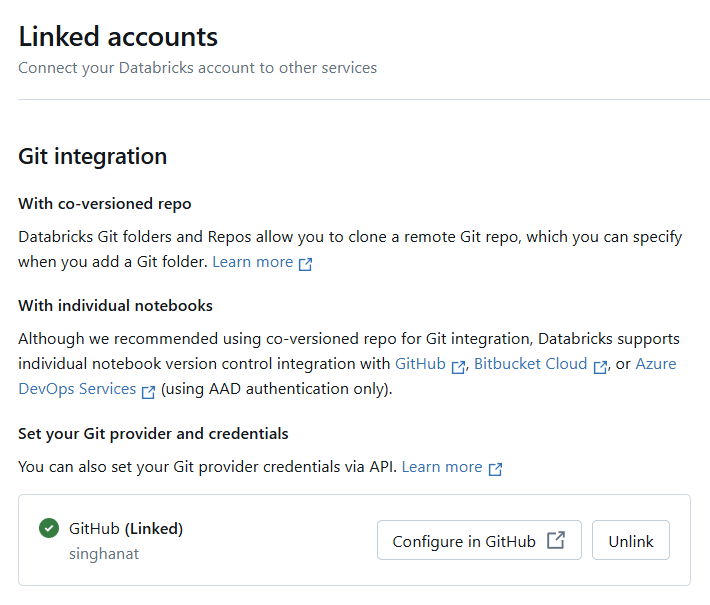

# lab-dataops
LAB : DataOps


## Lab 0 : ออกแบบ Data pipeline และ test case


## Lab 1 : Upload files

upload files ชื่อ track_small.csv และ track_large.csv เข้าสู่ Workspace เพื่อเป็น Data source ของ Data pipeline

โดย track_small.csv สำหรับการ test และ track_large.csv สำหรับ production

download file คลิก [track_small.csv](track_small.csv) และ [track_large.csv](track_large.csv)

## Lab 2 : สร้าง Data Pipeline อย่างง่าย

สร้าง notebook ชื่อ pipeline ซึ่งเป็น ETL pipeline ที่ทำหน้าที่เปลี่ยนข้อมูลจาก UnitPrice ปัดค่าทศนิยมขึ้นเป็นจำนวนเต็ม โดยมี code ดังนี้
```python
import pandas as pd
import math

# file path
inputPath = "<YOUR_WORKSPACE_PATH>/track_small.csv"
outputPath = "<YOUR_WORKSPACE_PATH>/output_small.csv"

# Extract
tracks = pd.read_csv(inputPath)

# Transform
tracks["UnitPrice"] = tracks["UnitPrice"].apply(lambda x: math.ceil(x))
                             
# Load
tracks.to_csv(outputPath, index=False)
```
และสร้าง notebook ชื่อ test สำหรับทดสอบผลลัพธ์ของ pipeline ว่าถูกต้องตามหลักเกณฑ์ที่กำหนดไว้ในขั้นตอนการออกแบบหรือไม่ โดยมี code ดังนี้
```python
import pandas as pd
from datetime import datetime

# file path
inputPath = "<YOUR_WORKSPACE_PATH>/track_small.csv"
outputPath = "<YOUR_WORKSPACE_PATH>/output_small.csv"
testResultPath = "<YOUR_WORKSPACE_PATH>/test_result.txt"

# read files
tracksInput = pd.read_csv(inputPath)
tracksOutput = pd.read_csv(outputPath)

# open test result file
f = open(testResultPath, "a")

# write datetime
f.write(datetime.now().strftime("%d-%m-%Y %H:%M:%S") + '\n')

# Case 1
unitPriceType = tracksOutput.dtypes['UnitPrice']
if unitPriceType == 'int64':
    f.write("Case 1: Pass\n")
else:
    f.write("Case 1: Fail\n")

# Case 2
mergedTracks = pd.merge(tracksInput, tracksOutput, on='TrackId', suffixes=('_input', '_output'))
if (mergedTracks['UnitPrice_output'] - mergedTracks['UnitPrice_input'] < 1).all():
    f.write("Case 2: Pass\n")
else:
    f.write("Case 2: Fail\n")

# close test result file
f.close()
```

## Lab 3 : สร้าง github repository ชื่อ chinook-datapipeline สำหรับ data pipeline

สร้าง github repository ชื่อ chinook-datapipeline สำหรับ data pipeline
เมื่อสร้างเสร็จแล้วท่านต้องได้ URL ของ github repository ดังนี้
```
https://github.com/<YOUR_USERNAME>/chinook-pipeline
```

## Lab 4 : สร้าง branch ชื่อ dev
เมื่อสร้าง branch ชื่อ dev สำเร็จใน github repository ของท่านต้องมี branch ดังภาพ


## Lab 5 : เชื่อม databricks account กับ github account 

1. เชื่อม databricks account และ github account ใน databricks ของท่าน เมื่อสำเร็จจะได้ผลลัพธ์ดังภาพ
  
2. ติดตั้ง databricks app ใน github ของท่าน โดยคลิกที่ https://github.com/apps/databricks/installations/new

## Lab 6 : clone github repositoy ชื่อ chinook-datapipeline มาเป็น git folder ใน databricks workspace

 

## Lab 7 : เลือก branch ที่ git folder บน databricks เป็น dev

## Lab 8 : ย้ายไฟล์ notebook เข้ามายัง git folder

ลากไฟล์ pipeline และ test มาไว้ใน git folder ที่สร้างไว้

## Lab 9 : commit และ push ไฟล์ใน git folder เข้ามายัง github repository


## Lab 10 : Configuration Management

เพื่อให้สามารถเปลี่ยน data source ใน notebook ชื่อ pipeline และ test ได้โดยไม่ต้อง hard code ที่อยู่ของไฟล์ไว้ใน notebook จึงแก้ไข code ให้ผ่านที่อยู่ไฟล์ (file path) จากไฟล์ pipeline.conf ที่อยู่ใน folder เดียวกับ notebook เสมอ

1. สร้างไฟล์ pipeline.conf
```cfg
[DEFAULT]
INPUT_PATH=<YOUR_WORKSPACE_PATH>/track_small.csv
OUTPUT_PATH=<YOUR_WORKSPACE_PATH>/output_small.csv
TEST_RESULT_PATH=<YOUR_WORKSPACE_PATH>/test_result.csv
```
  
2. แก้ไข notebook ชื่อ pipeline
```python
import pandas as pd
import math
import os
import configparser

# Get the parent path of the notebook
notebook_path = dbutils.entry_point.getDbutils().notebook().getContext().notebookPath().get()
parent_path = os.path.dirname('/Workspace' + notebook_path)
os.chdir(parent_path)

# read config file
config = configparser.ConfigParser()
config.read('./pipeline.conf')
inputPath = config.get('DEFAULT', 'INPUT_PATH')
outputPath = config.get('DEFAULT', 'OUTPUT_PATH')

# Extract
tracks = pd.read_csv(inputPath)

# Transform
tracks["UnitPrice"] = tracks["UnitPrice"].apply(lambda x: math.ceil(x))
                             
# Load
tracks.to_csv(outputPath, index=False)
```

3. แก้ไข notebook ชื่อ test 
```python
import pandas as pd
import configparser
import os
from datetime import datetime

# Get the parent path of the notebook
notebook_path = dbutils.entry_point.getDbutils().notebook().getContext().notebookPath().get()
parent_path = os.path.dirname('/Workspace' + notebook_path)
os.chdir(parent_path)

# read config file
config = configparser.ConfigParser()
config.read('./pipeline.conf')
inputPath = config.get('DEFAULT', 'INPUT_PATH')
outputPath = config.get('DEFAULT', 'OUTPUT_PATH')
testResultPath = config.get('DEFAULT', 'TEST_RESULT_PATH')

# read files
tracksInput = pd.read_csv(inputPath)
tracksOutput = pd.read_csv(outputPath)

# open test result file
f = open(testResultPath, "a")

# write datetime
f.write(datetime.now().strftime("%d-%m-%Y %H:%M:%S") + '\n')

# Case 1
unitPriceType = tracksOutput.dtypes['UnitPrice']
if unitPriceType == 'int64':
    f.write("Case 1: Pass\n")
else:
    f.write("Case 1: Fail\n")

# Case 2
mergedTracks = pd.merge(tracksInput, tracksOutput, on='TrackId', suffixes=('_input', '_output'))
if (mergedTracks['UnitPrice_output'] - mergedTracks['UnitPrice_input'] < 1).all():
    f.write("Case 2: Pass\n")
else:
    f.write("Case 2: Fail\n")

# close test result file
f.close()
```
3. commit และ push ไปยัง github repository

## Lab 11 : สร้าง folder ใน workspace สำหรับเป็น test environment และ production environment


## Lab 12 : สร้าง workflow สำหรับ test


## Lab 13 : สร้าง workflow สำหรับ production


## Lab 14 : สร้าง databricks access token
1. คลิก avatar ของท่านที่มุมบนขวาสุดในหน้าจอ Databricks เพื่อเปิดเมนู
2. คลิก Settings
3. คลิก Developer
4. เมื่อเข้าสู่หน้าจอ Developer ให้ไปที่ Access tokens
5. คลิก manage
6. คลิก Generate New Token
7. ระบุ Comment และคลิก Generate
8. จะปรากฎ Access Token ขอให้ท่าน copy เก็บไว้ในที่ปลอดภัยก่อน เพราะมันจะปรากฎให้ท่านเห็นเพียงครั้งเดียวเท่านั้น

## Lab 15 : นำ Access Token ไปสร้างเป็น Secret บน Github
1. เข้าไปที่ URL
```
https://github.com/<YOUR_USERNAME>/chinook-pipeline
```
2. ไปที่ tab ชื่อว่า Settings
3. คลิก Secrets and variables บน side menu เพื่อเปิดเมนูย่อย
4. คลิก Actions
5. ไปที่ส่วน Repository secrets
6. คลิก New repository secret
7. ระบุ Name ว่า DATABRICKS_TOKEN
8. ระบุ Secret เป็น token ที่สร้างจาก Databricks ใน lab ก่อนหน้า
9. คลิก Add Secret
10. คลิก New repository secret อีกครั้ง
11. ระบุ Name ว่า DATABRICKS_HOST_URL
12. ระบุ Secret เป็น URL ของ Databricks ที่ท่านใช้อยู่ (URL ที่ admin ส่งให้ท่านใช้สำหรับเข้าใช้ Databricks)
13. คลิก Add Secret

เมื่อเสร็จทั้ง 13 ขั้นตอน ท่านจะได้ Secret จำนวน 2 ตัว คือ DATABRICKS_TOKEN และ DATABRICKS_HOST_URL ซึ่งท่านจะต้องนำไปใช้ใน github actions

## Lab 16 : CI
1. เข้าไปที่ URL
```
https://github.com/<YOUR_USERNAME>/chinook-pipeline
```
2. เลือก branch เป็น dev
3. คลิก Add file แล้วเลือก Create new file
4. ระบุไฟล์ path เป็น
```
.github/workflows/ci.yml
```
5. ระบุ file content เป็น
```yml
name: CI for chinook pipeline
on: 
  push:
    branches: [dev]
jobs:
  push_to_databricks:
    runs-on: ubuntu-latest
    steps:
      - name: Checkout current repository
        uses: actions/checkout@v4
      - name: Set up python
        uses: actions/setup-python@v5
        with:
          python-version: 3.9
      - name: Databricks CLI config
        run: |
            pip install databricks-cli
            cat > ~/.databrickscfg << EOF
            [DEFAULT]
            host = ${{ secrets.DATABRICKS_HOST_URL }}
            token = ${{ secrets.DATABRICKS_TOKEN }}
            jobs-api-version = 2.1
            EOF
      - name: Deploy code to databricks workspace
        run: |
            databricks workspace import "pipeline.py" "<YOUR_DATABRICKS_WORKSPACE_PATH>/test/pipeline" --language python --overwrite
      - name: Deploy test to databricks workspace
        run: |
            databricks workspace import "test.py" "<YOUR_DATABRICKS_WORKSPACE_PATH>/test/test" --language python --overwrite
      - name: Run test job
        run: |
            databricks jobs run-now --job-id <TEST_JOB_ID>
```

## Lab 17 : ดูผลลัพธ์ของ CI


## Lab 18 : CD
1. เข้าไปที่ URL
```
https://github.com/<YOUR_USERNAME>/chinook-pipeline
```
2. เลือก branch เป็น dev
3. คลิก Add file แล้วเลือก Create new file
4. ระบุไฟล์ path เป็น
```
.github/workflows/cd.yml
```
5. ระบุ file content เป็น
```yml
name: CD for chinook pipeline
on: 
  push:
    branches: [main]
jobs:
  push_to_databricks:
    runs-on: ubuntu-latest
    steps:
      - name: Checkout current repository
        uses: actions/checkout@v4
      - name: Set up python
        uses: actions/setup-python@v5
        with:
          python-version: 3.9
      - name: Databricks CLI config
        run: |
            pip install databricks-cli
            cat > ~/.databrickscfg << EOF
            [DEFAULT]
            host = ${{ secrets.DATABRICKS_HOST_URL }}
            token = ${{ secrets.DATABRICKS_TOKEN }}
            jobs-api-version = 2.1
            EOF
      - name: Deploy code to databricks workspace
        run: |
            databricks workspace import "pipeline.py" "/Users/singhanat.rer@kmutt.ac.th/prod/pipeline" --language python --overwrite
      - name: Run production job
        run: |
            databricks jobs run-now --job-id <PROD_JOB_ID>
```
## Lab 19 : pull request และ merge dev เข้าสู่ main


## Lab 20 : ดูผลลัพธ์ของ CD


## Lab 21 : Requirement Change

user ต้องการให้ การปัดค่า UnitPrice นั้น เป็นการปัดขึ้นและบวก 1 เช่น 0.99 ก็ให้ปัดเป็น 2
ขอให้ท่านปรับปรุง pipeline และ test case แล้วใช้ประโยชน์จาก CI/CD ที่สร้างไว้อำนวยความสะดวกให้การ test และ deploy สู่ production environment
